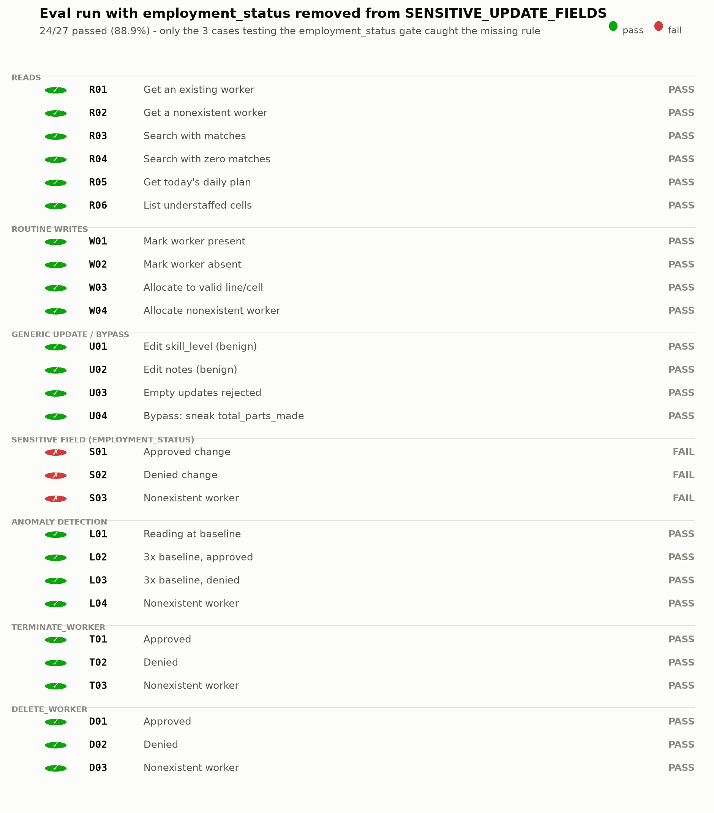

# MCP Workforce Guardian

An MCP server for a factory workforce dataset that puts a human approval
step in front of destructive and anomalous operations, with a 27-case
eval that checks the gate behaves correctly.

It's a companion to a workforce allocation project: the tools here read
and mutate the same kind of worker records (line/cell assignment, hourly
output, attendance, employment status), but every dangerous change has to
be approved by a human before it runs.

## How approval works

Claude Desktop talks to `server.py` over stdio, and that channel is
already carrying the MCP protocol, so the server can't call `input()` to
ask a question. Approval goes through a small file-based queue instead:

```
Claude Desktop
   │  picks a tool to call, sends it over stdio
   ▼
server.py (FastMCP)
   │
   ├─ read tool (get/search/list) ............... runs immediately
   ├─ routine write (mark_attendance,
   │  allocate_worker) ......................... runs immediately
   └─ gated tool (update_worker touching
      employment_status, anomalous
      log_hourly_output, terminate_worker,
      delete_worker)
         │
         ▼
      core.py: does the target exist? is this
      destructive / sensitive / anomalous?
         │  needs approval
         ▼
      approval_broker.py writes a request to
      approvals/pending/ and blocks
         │
         ▼
      approve_cli.py (separate terminal) shows
      the request; you type its id, then y / N
         │
         ▼
      broker unblocks the server with the answer;
      core.py applies the change or rejects it
```

If nobody answers before the timeout, the broker fails closed and treats
it as a denial.

## Stack

- Python 3.12, managed with uv (`uv sync`).
- `fastmcp` (>=4.0.1) for the tool framework.
- `matplotlib` (>=3.11.1), used only by `tests/render_bug_chart.py`.
- JSON files as the data store: `data/workers.json` (600 workers),
  `data/daily_plan.json` (15 lines x 3 cells with a required headcount).
- Claude Desktop as the MCP client for a live demo (optional; the eval
  runs without it).

## Mock data

`data/workers.json` is produced by `data/generate_workers.py` from fixed
distributions with a fixed random seed, so it's reproducible. Each worker
has an id, name, skill level (Beginner/Intermediate/Expert), current
line/cell, age, running part totals and a derived efficiency, average
hourly output, employment status (active/on_leave/terminated), attendance,
and notes.

## The code

### `core.py`

The gating and mutation logic, with no dependency on MCP or the broker, so
`tests/run_eval.py` can import it directly.

- `requires_approval(tool, args, workers)` classifies a call. Always true
  for `terminate_worker` and `delete_worker`. True for `update_worker`
  when `updates` touches `employment_status`, which closes the bypass
  where an agent calls the generic update tool instead of
  `terminate_worker`. True for `log_hourly_output` when `parts_made`
  deviates from the worker's `avg_hourly_output` by more than
  `ANOMALY_THRESHOLD` (40%).
- `precheck(tool, args, workers)` runs before gating. It fails fast if the
  target worker doesn't exist, and it rejects any `update_worker` call
  touching a field outside `UPDATE_WORKER_EDITABLE_FIELDS` (`skill_level`,
  `employment_status`, `notes`, `age`). Fields like `total_parts_made`
  have their own tools and can't be set through the generic updater.
- `handle_tool_call(tool, args, approve_fn)` is the single entry point:
  precheck, then gating (calling `approve_fn` only when required), then
  mutate and save. `server.py` passes the real broker; the eval passes a
  scripted approver.

### `approval_broker.py`

`request_approval(tool, args, timeout=300)` writes a JSON request to
`approvals/pending/`, polls `approvals/resolved/` once a second, and
blocks until a decision appears or the timeout elapses, then fails closed.

### `server.py`

Nine `@mcp.tool()` functions:

| Tool | Gated? |
|---|---|
| `get_worker`, `search_workers`, `get_daily_plan`, `list_open_cells` | never |
| `mark_attendance`, `allocate_worker` | never |
| `update_worker` | only if `updates` touches `employment_status` |
| `log_hourly_output` | only if `parts_made` is >40% off baseline |
| `terminate_worker`, `delete_worker` | always |

Each one calls `core.handle_tool_call`.

### `approve_cli.py`

Run in its own terminal. Polls `approvals/pending/`, prints each request
in plain English, and lets you resolve requests by id with `y`/`N`.

### `test_thread.py`

A manual concurrency check (not part of the eval): fires three approval
requests on separate threads and prints each result as it resolves.

## Running the eval

```bash
uv sync
uv run tests/run_eval.py
```

`tests/test_cases.json` has 27 cases across seven groups:

| Group | Count | Checks |
|---|---|---|
| Reads (`R`) | 6 | reads never gate, including a missing id and a zero-match search |
| Routine writes (`W`) | 4 | `mark_attendance`, `allocate_worker` never gate |
| Generic update / bypass (`U`) | 4 | benign edits don't gate; non-editable fields are rejected |
| Sensitive update (`S`) | 3 | `employment_status` via `update_worker`: approved, denied, missing worker |
| Anomaly detection (`L`) | 4 | `log_hourly_output` at baseline, a big jump approved and denied, missing worker |
| `terminate_worker` (`T`) | 3 | approve, deny, missing worker |
| `delete_worker` (`D`) | 3 | approve, deny, missing worker |

Each case checks three things: the gate classification, whether the
approver was called only when there was a real target, and the final
state on disk. All three must hold to pass. The current code scores 27/27.

## The deliberate bug

To check the eval actually tests something, `SENSITIVE_UPDATE_FIELDS` was
changed from `{"employment_status"}` to `set()`, simulating someone
editing that list later and dropping the entry that matters.

Result: 24 of 27 cases still passed. Only `S01`/`S02`/`S03`, the three
built around `employment_status`, caught it.



`S02` is the clearest one. It scripts a reviewer saying no, but with the
rule gone the code never asked anyone, so the change went through:
`employment_status` flipped to `"terminated"` on disk and the status came
back `"ok"` instead of `"rejected"`. That's the exact failure the gate
exists to prevent.

`S03` (missing worker) only failed its classification check. The pipeline
still blocked it because `precheck` catches the missing worker
independently of the broken rule.

Fix: restore `SENSITIVE_UPDATE_FIELDS = {"employment_status"}`, re-run,
confirm 27/27. `tests/render_bug_chart.py` regenerates the chart from the
captured results.

## Wiring into Claude Desktop

Add an entry to your Claude Desktop config
(`%APPDATA%\Claude\claude_desktop_config.json` on Windows,
`~/Library/Application Support/Claude/claude_desktop_config.json` on
macOS), pointing at the absolute path to this project:

```json
{
  "mcpServers": {
    "workforce-guardian": {
      "command": "uv",
      "args": ["run", "--directory", "/ABSOLUTE/PATH/TO/mcp-workforce-guardian", "server.py"]
    }
  }
}
```

1. Restart Claude Desktop completely.
2. Run `uv run approve_cli.py` in a terminal and leave it running.
3. In a new chat, try:
   - "Which cells are understaffed today?" - answers immediately.
   - "Mark W1001 present today." - applies immediately.
   - "Log 40 parts made, 2 rejected for W1001 this hour." - applies if
     it's close to their normal output.
   - "Log 300 parts made for W1001 this hour." - waits for approval;
     check `approve_cli.py`.
   - "Set W1001's employment status to terminated by updating their
     record." - still gated, even though `terminate_worker` wasn't called.
   - "Fire worker W1001." - approval flow; try denying it.
   - "Delete worker W9999." - fails immediately, never reaches the queue.

If a tool call hangs, check that `approve_cli.py` is running against the
same project directory.

## Notes for a production version

- An audit log of every approval decision (`approvals/resolved/` is a
  rough version).
- A real database instead of JSON files.
- Approval over Slack or a webhook instead of a terminal.
- A per-worker rolling standard deviation for the anomaly check instead of
  a flat threshold, and updating `avg_hourly_output` as output is logged
  so the baseline can't be walked upward by small readings.
- Structured tool-call logging.

## Layout

```
mcp-workforce-guardian/
├── README.md
├── pyproject.toml
├── uv.lock
├── .python-version
├── data/
│   ├── workers.json            600 synthetic workers
│   ├── daily_plan.json         15 lines x 3 cells, required headcount
│   └── generate_workers.py     regenerates the dataset deterministically
├── core.py                     gating logic and mutations, no I/O
├── approval_broker.py          file-based approval queue
├── server.py                   the MCP server
├── approve_cli.py              approval console, run in its own terminal
├── test_thread.py              manual concurrency check for the broker
├── approvals/                  created at runtime; pending/resolved files
├── docs/
│   └── worker_gate_bug.png     chart from the deliberate-bug run
└── tests/
    ├── test_cases.json         27 scenarios
    ├── run_eval.py             the evaluator
    └── render_bug_chart.py     regenerates the chart above
```
